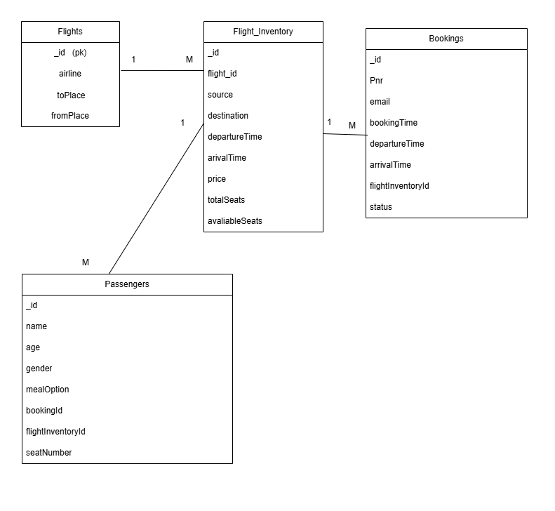
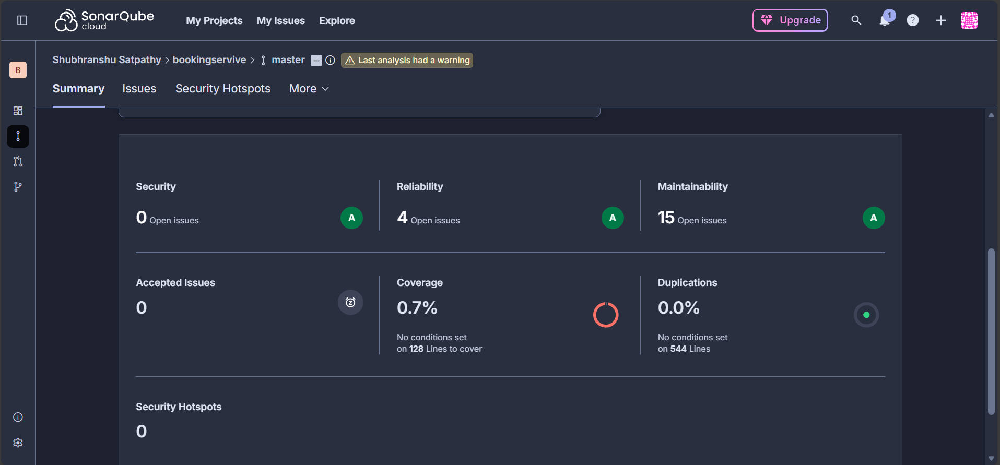
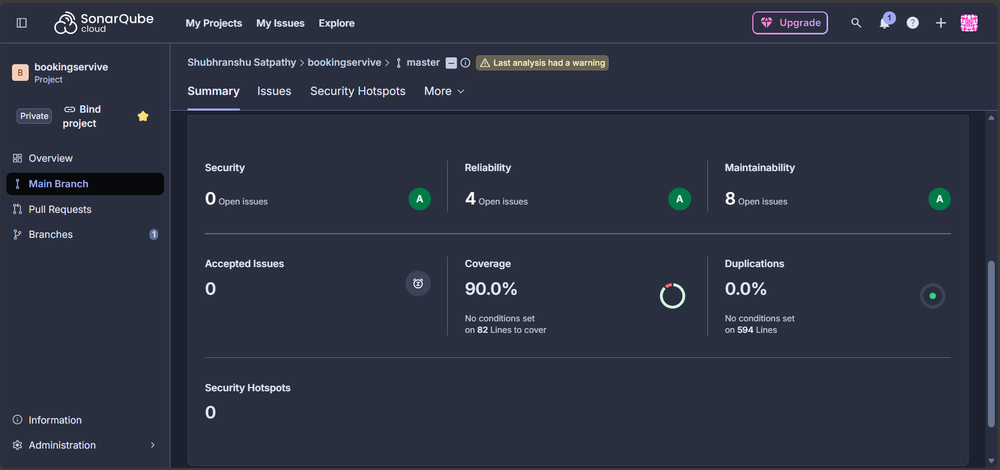
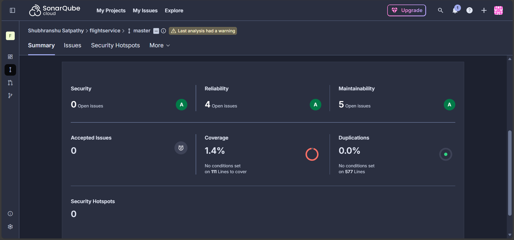
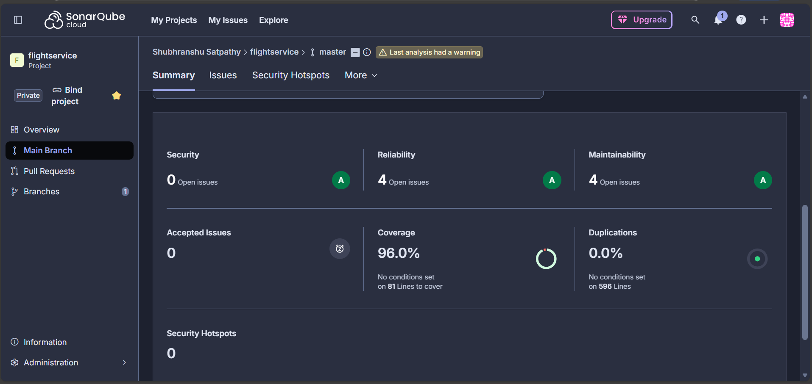

# Flight Booking System using MicroService and MongoDB

  

---

## Overview
This project implements a Flight Booking System using Microservices architecture with MongoDB as the database. The system provides various functionalities such as adding flight inventory, searching for flights, booking tickets, canceling tickets, and retrieving ticket history.
   - Have also added basic Producer and Consumer using Kafka.
   - Used OpenFeign for inter-service communication between Booking and Flight services.
   - Used Config Server
   - Used Eureka Server
   - Used Api Gateway 

## 1. addInventory Method  (POST /api/flight/airline/inventory)

1. Perform initial validation on `flightNumber`, `date`, `source`, `destination`, etc.  
2. If validation passes, search the `flightInventory` to check if the flight already exists for that date.   
3. If all checks pass:  
   - Add a new `flightInventory` entry and also add the flight if it does not exist.  
4. Return **201 Created** if successful.  
5. If any validation fails, return **400 Bad Request**.  

## 2. searchFlights Method  (POST /api/flight/search)  

1. Perform initial validation on `date`, `source`, `destination`, etc.  
2. Determine if the search is **One-Way** or **Round-Trip**.  
3. For **One-Way**:  
   - Search the inventory for the given `date`, `source`, and `destination`.  
4. For **Round-Trip**:  
   - Search the inventory for both directions (`source → destination` and `destination → source`) for the given start and return dates.  
5. If flights are found, return a list of flights.  
6. If no flights are found, return **404 Not Found**.  

## 3. bookTicket Method  (POST /api/flight/booking/{flightId})

1. Perform initial validation on `seat`, `gender`, etc.  
2. Search the inventory to check if the flight exists (Via OpenFeign).    
3. If all checks pass:  
   - Reduce available seats in the inventory.  
   - Add a new booking and passenger details.  
4. Return the **PNR number** with **201 Created** if successful.  
5. If any validation fails, return **400 Bad Request**.  

## 4. cancelTicket Method  (DELETE /api/flight/booking/cancel/{pnr})

1. Search for the ticket based on `PNR` and status `"BOOKED"`.  
2. If found, check the **24-hour cancellation rule**.  
3. If allowed:  
   - Update ticket status to `"CANCELED"`.  
   - Increase available seats in the inventory.(Via OpenFeign)  
4. Return **200 OK** if successful.  

## 5. getTicket Method  (GET /api/flight/booking/history/{email})

1. Search for tickets based on the user’s email.  
2. If found, return ticket details along with passenger information.  
3. If not found, return **404 Not Found**.  

## 6. getHistory Method  (GET /api/flight/ticket/{pnr})

1. Search for tickets based on the `PNR`.  
2. If found, return ticket details along with passenger information.  
3. If not found, return **404 Not Found**.  

---

## Sonar Qube Report

1. Booking Before:
  

2. Booking After:

3. Flight Before:
  

4. Flight After:

